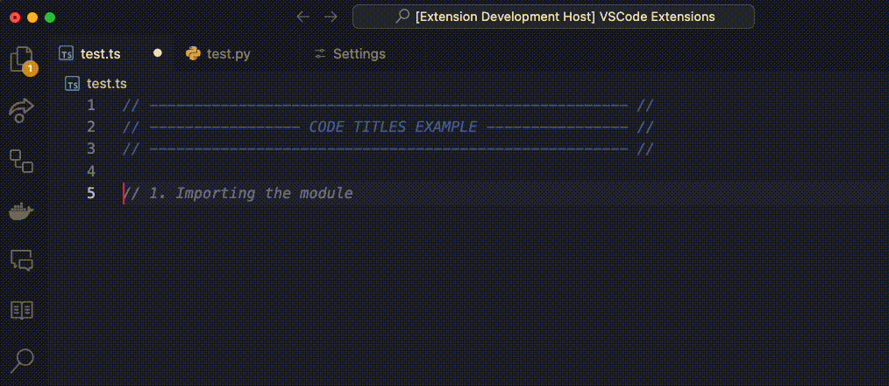

```
       ______     ______     _____     ______
      /\  ___\   /\  __ \   /\  __-.  /\  ___\
      \ \ \____  \ \ \/\ \  \ \ \/\ \ \ \  __\
       \ \_____\  \ \_____\  \ \____-  \ \_____\
        \/_____/   \/_____/   \/____/   \/_____/

 ______   __     ______   __         ______     ______
/\__  _\ /\ \   /\__  _\ /\ \       /\  ___\   /\  == \
\/_/\ \/ \ \ \  \/_/\ \/ \ \ \____  \ \  __\   \ \  __<
   \ \_\  \ \_\    \ \_\  \ \_____\  \ \_____\  \ \_\ \_\
    \/_/   \/_/     \/_/   \/_____/   \/_____/   \/_/ /_/


```

# Code Titler

This is a simple extension to create uniform titles and subtitles for your code blocks directly on VSCode.

The titles and subtitles will have the same length. That helps to identify sections and subsections on your code.

I come from a art background, so I'm very visual with my code organisation. (Some call it OCD.)

## Features

There are two ways to build your titles and subtitles.

-   1 With a shortcut

    ```
    Subtitle => (Ctrl + Cmd + / ) for Mac users

    Subtitle => (Ctrl + Alt + / ) for Windows users

    Title => (Ctrl + Shift + Cmd + / ) for Mac users

    Title => (Ctrl + Shift + Alt + / ) for Windows users
    ```

-   2 With a "snippet" shortcut

    ```
    Subtitle => $st

    Title => $t
    ```

    Once you type those snippets an input prompt will open.
    Whatever you type in there after you press enter will be your new subtitle



You can Resize the titles on a document. For that hit the shortcut:

```
Resize => (Ctrl  + Cmd + r ) for Mac users
Resize => (Ctrl  + Alt + r ) for Windows users
```

That will only change the titles on that active document.

## How does it work

Code Titler looks for a pattern built from a : CommentTag + fill
It will look for both open and close tags to register it as a title.

```
Title Pattern
openTag + fill + Title + fill + closeTag
```

The extension does not keep any Log of the titles. (Maybe on a future version I might try to create a "Page of Contents")
For now It'll create uniform size titles, read the document to apply decoration to the titles, read the document to resize the titles.

## Extension Settings

You can change the fill, length and personalise open and close tabs.

open and close tabs => are the syntax for whatever language you are using.

fill => is gonna take the "blank space" necessary to keep all your titles and subtitles to the same size.

Personalised tags => In case there are another language and syntax that is not supported yet. Fell free to change on those settings.


There's also a styling settings that you can change colour, font style, font weight and background colour of the titles.


## Known Issues

-   For now if you use more than one character on the fill the titles will get a different lenght. I'm planning on fixing that for version 2

-   Because of a the font sizes on VSCode vs Github, this extension will not work well on .md files. Might look great on your VSCode, while you're writting your readme.md. But once You push it to github I'll get some random sizes for each part of the titles.

## Release Notes

### 0.0.1

Initial release of my very first VS Code Extension.

### 0.1.0

First minor update after some testing.

-   Trim whitespaces on beginning and ending of title
-   Added Titles to repo.

### 0.2.0

-   Added styling to title - Colour, Font Weight, Font Style and Background colour

### 0.2.4

-   Added / Fixed javascript react titles not working
-   Now if the language is not on the list of supported ones the title will fall back to the personalised tag

## Thoughts?

Anyone that is keen to collaborate is welcome. Feel free to send me a message or drop an issue and we can build stuff together.

I know that this is a simple extension but I hope it help keeping devs codes organised.
